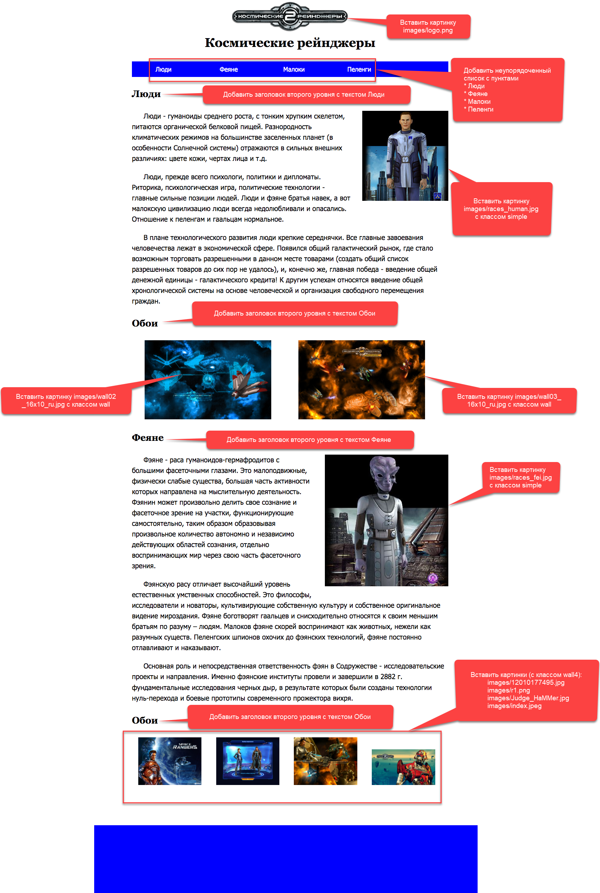

# Экзамен

Экзамен состоит из двух частей: теоретической и практической.

Теоретическая часть состоит из ответов на вопросы: [Открыть](https://forms.gle/Kx5yLGM8UAnNXWYT9)

Практическая часть состоит в редактировании веб-страницы

Для этого необходимо скачать архив проекта по этой ссылке: [жмак](practice/space_rangers.zip)

В архиве есть веб-страница `index.html`, но злые Малоки украли некоторые строки кода.
Хорошо, что остались комментарии и скриншот старого сайта.

Ваша задача все исправить.

Для этого нужно:

* Подключить стиль из файла `css/style.css`
* Вставить картинку `images/logo.png`
* Добавить неупорядоченный список с пунктами: Люди, Феяне, Малоки, Пеленги
* Добавить заголовок второго уровня с текстом Люди
* Вставить картинку `images/races_human.jpg` с классом **simple**
* Добавить заголовок второго уровня с текстом Обои
* Вставить картинку `images/wall02_16x10_ru.jpg` с классом **wall**
* Вставить картинку `images/wall03_16x10_ru.jpg` с классом **wall**
* Добавить заголовок второго уровня с текстом Феяне
* Вставить картинку `images/races_fei.jpg` с классом simple
* Вставить картинки (с классом wall4): `images/12010177495.jpg`, `images/r1.png`, `images/Judge_HaMMer.jpg`, `images/index.jpeg`

