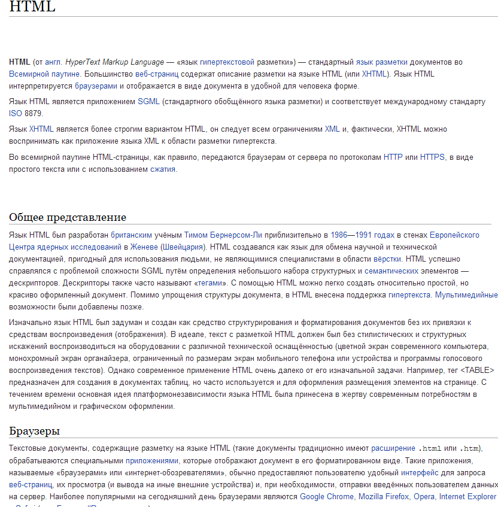
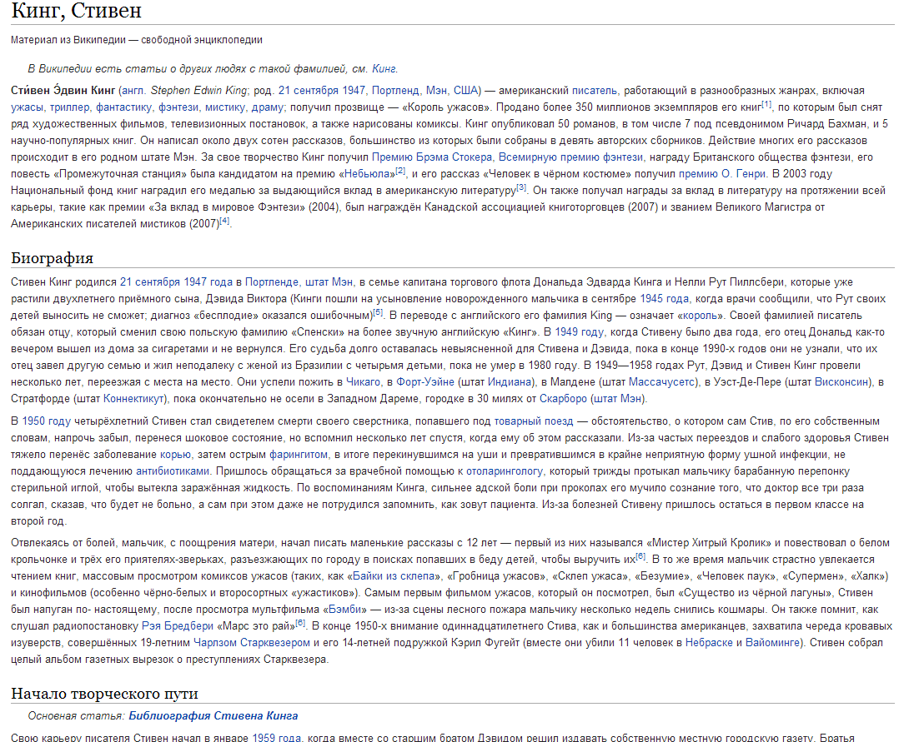

# Домашнее задание

## Задание 1

Необходимо написать html страницу википедии как на рис:

Текст набирать вручную не нужно т.к. он находится в [файле](task01.txt).

## Задание 2

Необходимо написать html страницу википедии как на рис:

Текст набирать вручную не нужно т.к. он находится в [файле](task02.txt).
