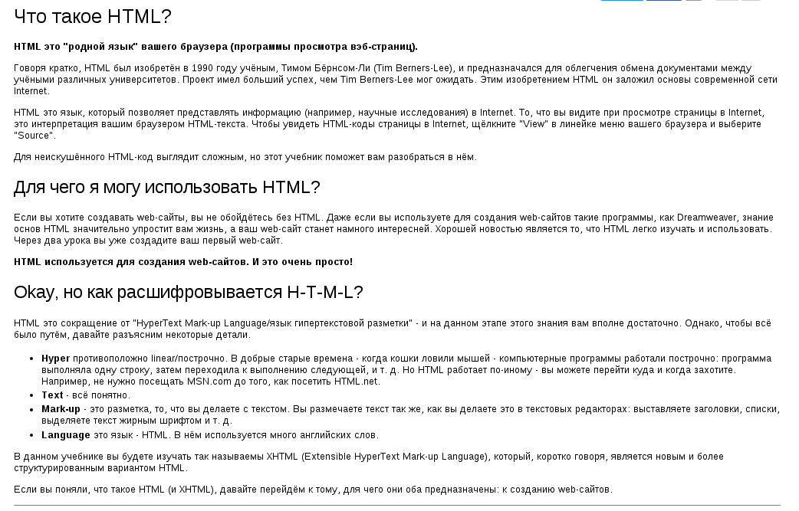
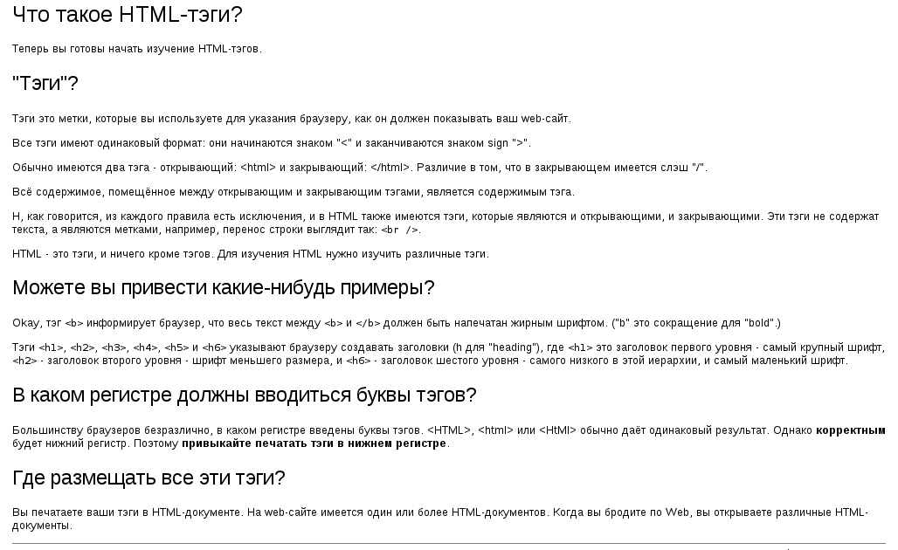
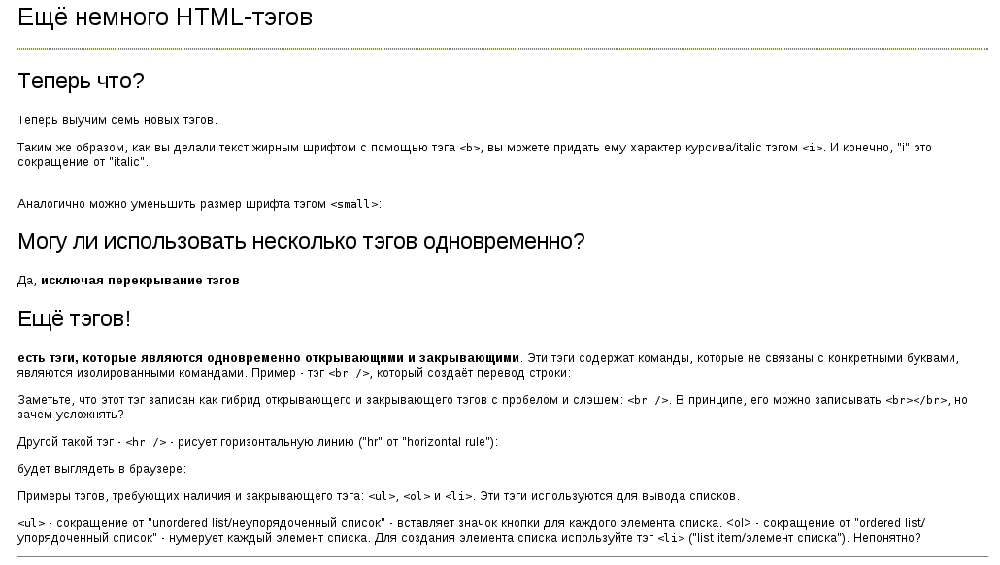

# Практическое задание

## Задание 1

1. Загрузите и распакуйте на рабочий стол [архив по этой ссылке](workshop.zip)
2. Откройте файл Lesson1.html, который находиться в папке workshop, в браузере
3. Следуйте инструкциям, которые вы видите в диалоговом окне

## Задание 2

Необходимо написать html страницу как на рис 1:

Текст набирать вручную не нужно т.к. он находится в [файле](task01.txt).

## Задание 3

Необходимо написать html страницу как на рис 2:

Текст набирать вручную не нужно т.к. он находится в [файле](task02.txt).

## Задание 4

Необходимо написать html страницу как на рис 3:

Текст набирать вручную не нужно т.к. он находится в [файле](task03.txt).
