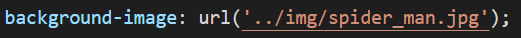
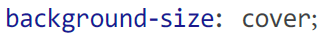
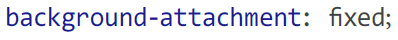
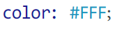
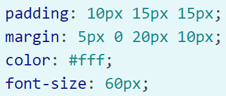
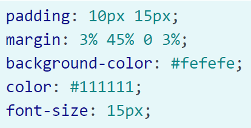

# Домашнее задание

В этом домашнем задании вам нужно закрепить знания в CSS

## Задание 1

Измените код в проекте, который можно загрузить по [ссылке](task01.zip), таким образом, чтобы он правильно работал. В приведенном примере не заданы стили, самостоятельно добавьте их.

1. Добавьте для элемента body такие стили:

    * задайте фоновое изображение

        
    <!-- ```css
    background-image: url('img/spider_man.jpg');
    ``` -->

    * установите свойство, чтобы это изображение занимало весь экран:

        
    <!-- ```css
    background-size: cover;
    ``` -->

    * зафиксируйте изображение на экране

        
    <!-- ```css
    background-attachment: fixed;
    ``` -->

2. Добавьте такие стили для `h1`:

    * задайте цвет шрифта:

        
    <!-- ```css
    color: #FFF;
    ``` -->

## Задание 2

Создайте страничку о герое комиксов __Spider-Man__, используя язык разметки `HTML` и стили `CSS`.

К заданию был добавлен проект, которы можно загрузить по [ссылке](task02.zip), но __Green Goblin__, злодей и один из главных противников __Spider-Man__, выкрал из нашего кода все стили. Осталось только фоновое изображение для тега `<body>`. 

Верните в код все стили и сделайте программу прежней!

Для этого проделайте такие шаги:

1. Для заголовка `h1` были заданы следующие стили:

    

    <!-- ```css
    padding: 10px 15px 15px;
    margin: 5px 0 20px 10px;
    color: #fff;
    font-size: 60px;
    ``` -->
2. Для абзаца `p` были установлены такие стили:

    
    <!-- ```css
    padding: 10px 15px;
    margin: 3% 45% 0 3%;
    background-color: #fefefe;
    color: #111111;
    font-size: 15px;
    ``` -->
В результате должна открыться страничка, как на изображении

