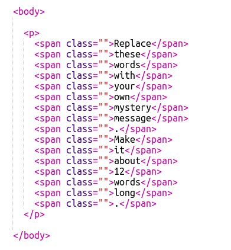
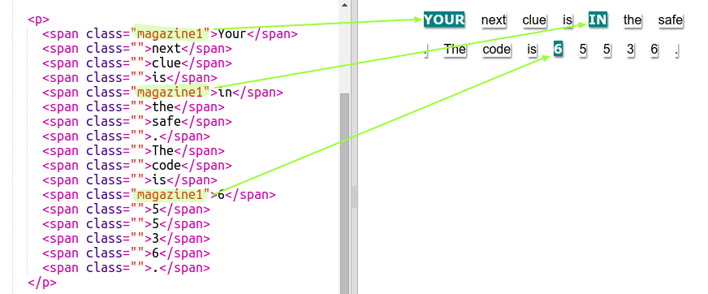
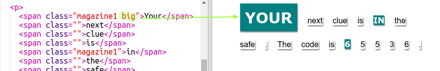
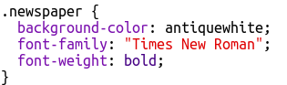
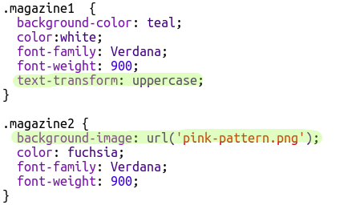
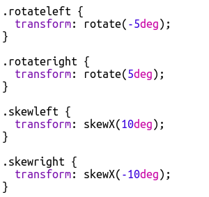
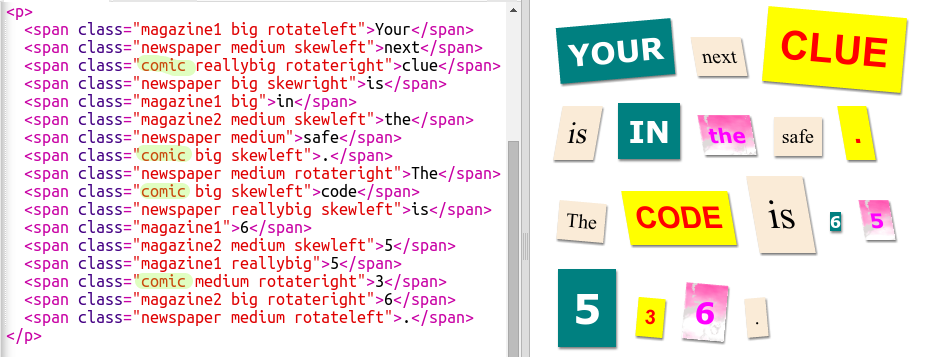
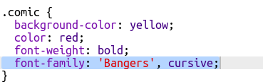

# Практическое занятие

<!-- https://projects.raspberrypi.org/en/projects/linked-roomss -->

На этом практическом занятии мы будем применять `CSS` для создания _мистического_ сообщения созданного из слов 'вырезанных из журналов'.

## Что нужно сделать

1. Загрузить заготовку практического задания по [ссылке](mystery-letter.zip)

2. Открыть файл `index.html`. Мы увидим следующий код:

    

3. Добавить классы `magazine1` к нужным полям:

    

4. Добавить класс `big`:

    

5. В файле `css/style.css` добавить стиль для класса `newspaper`:

    

6. Добавить стили для классов `magazine1` и `magazine2`:

    

7. Добавить стили для классов `rotateleft`,  `rotateright`, `skewleft` и `skewright`:

    

8. Добавить стили для класса `comic`:

    

9. Добавить классы к нужным элементам &lt;span> в файле index.html:

    

10. Добавить ссылку на шрифт [https://fonts.googleapis.com/css?family=Bangers](https://fonts.google.com/specimen/Bangers?selection.family=Bangers) в теге &lt;head> файла index.html :

    

11. Для того, что бы применить загруженный шрифт добавляем в файле css/style.css к классу `comic` атрибут `font-family`:

    
