# Практика на работу с гиперссылками

Сегодня практическое занятие будет посвящено созданию следующего проекта:

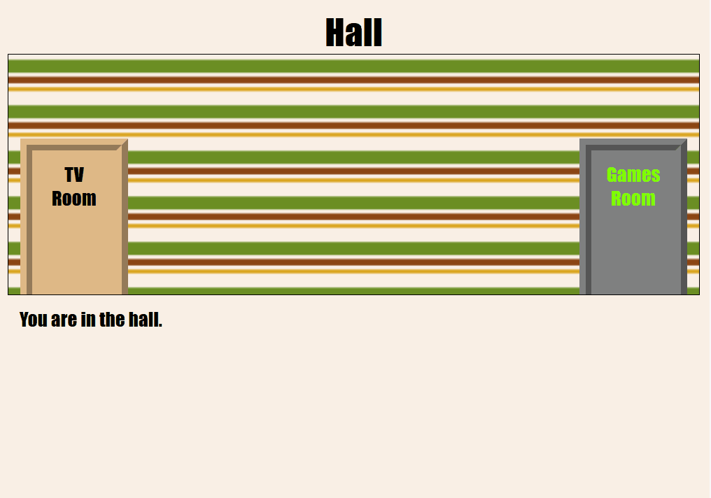

Есть три комнаты. Необходимо ходить между ними нажимая на двери.

Пошаговая инструкция:

1. Загрузите и распакуйте на рабочий стол заготовку проекта по [ссылке](linked-room.zip)
2. Откройте файл `index.html` в `vscode` и в `Chrome`. Появится страница комнаты:

    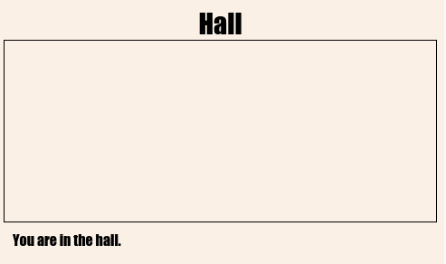

3. На странице `index.html` в элемент `div` с классом `room` добавить гипертекстовую ссылку с содержимым **TV Room** которая ведет на страницу `tvroom.html`:

    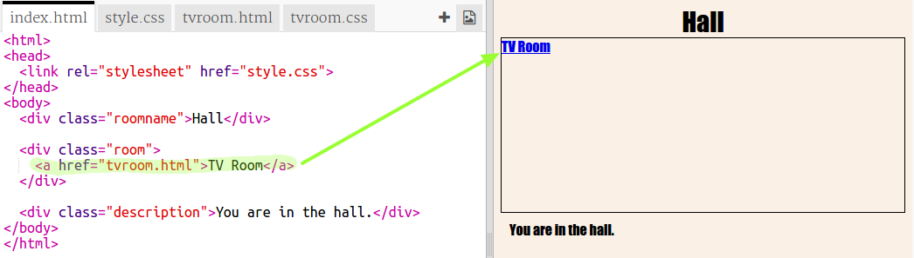

4. В `vscode` откройте файл `tvroom.html`:

    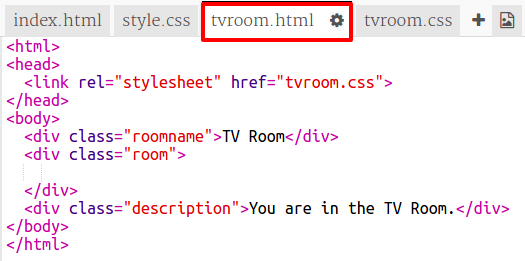

    В элемент `div` с классом `room` в файле `tvroom.html` необходимо добавить гипертекстовую ссылку с содержимым `Hall` которая ведет на страницу `index.html`.

    При открытии файла `tvroom.html` в браузере должна отображаться страница со следующим содержимым:

    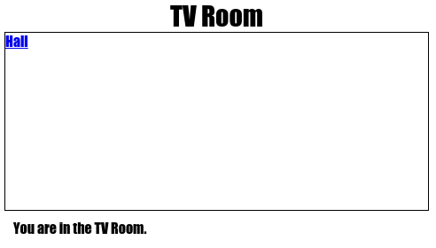

5. В `vscode` создайте новую `html` страницу `gamesroom.html` в которую добавить следующий текст:

    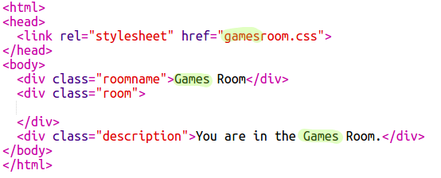

6. В `vscode` создайте новый файл `gamesroom.css` в который нужно добавить следующий текст:

    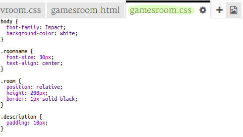

7. В элемент `div` с классом `room` в файле `index.html` необходимо добавить гипертекстовую ссылку с содержимым **Games Room** которая ведет на созданную страницу `gamesroom.html`:

    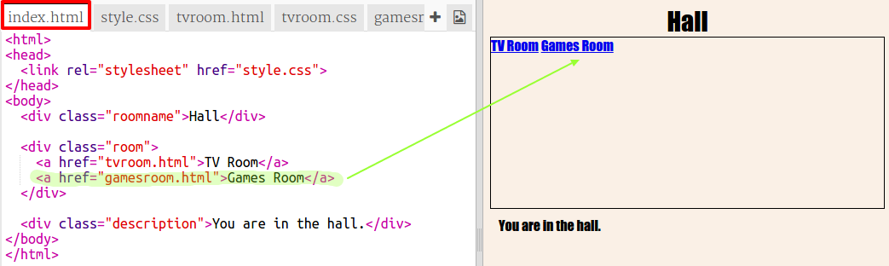

8. В файле `gamesroom.html`, который сейчас в барузере должен выглядеть так:

    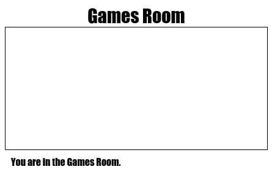

    добавить гипертекстовую ссылку на страницу **Hall**

9. **СДЕЛАЙ САМ**: В файле `gamesroom.css` поменяйте стиль фона страницы на **черный**, цвет шрифта класса `.roomname` и `.description` на **зеленый**, а также цвет границы для класса `.room` на **зеленый**. Игровая комната должна выглядеть так:

    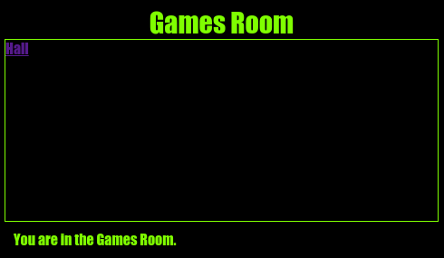

10. Открыть файл `index.html` в который добавить `div` элемент с идентификатором  `id="hall2tv"` и содержимым **TV Room** вместо текста гипертекстовой ссылки ведущей на страницу **TV Room** таким образом ссылка должна иметь вид двери:

    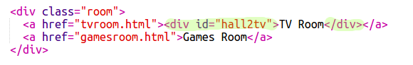

11. В файле `style.css` необходимо добавить следующий стиль для двери:

    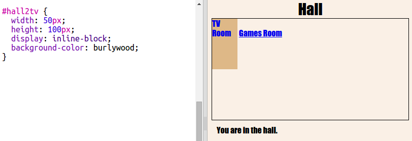

    Проверьте веб страницу в браузере кликая по двери, а не только по тексту.

12. Теперь, давайте сделаем вид больший похожий на дверь добавляя границу сверху, снизу и слева. Добавьте следующий код:

    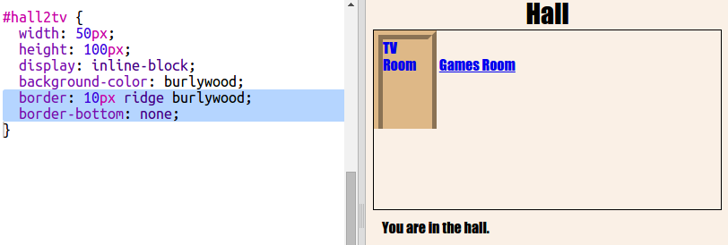

13. Добавим еще немного стиля для настройки текста:

    

14. Заметьте, что дверь весит в воздухе. Давайте переместим дверь вниз. Добавим абсолютное позиционирование, отступ снизу `0 пикселей`, отступ слева `10 пикселей`.

    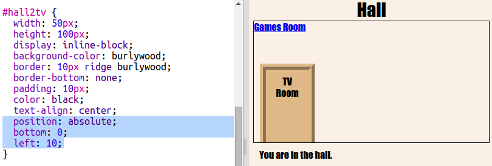

15. Также как мы настраивали стиль двери в файле `style.css` настройте стиль двери и в файле `tvroom.css`, только добавить отступ справа `10 пикселей`. Результат должен выглядеть следующим образом:

    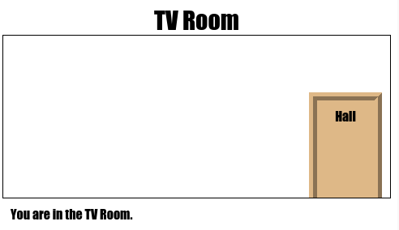

16. **СДЕЛАЙ САМ**: В файл `index.html` добить еще одну дверь, которая ведет в игровую комнату. Результат должен выглядеть так:

    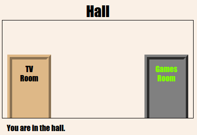

17. Клеим обои на стены. Для этого в файле `style.css` добавить фоновую картинку через свойство `background-image`:

    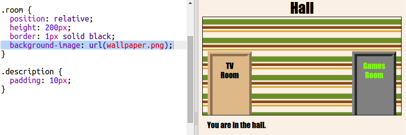

18. Дополнительное задание (на 12 баллов). В игровую комнату необходимо добавить дверь, ведущую на страницу `index.html` и картинки `space-invader.png`:

    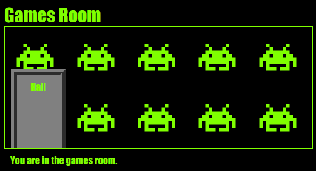