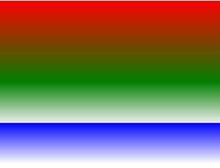
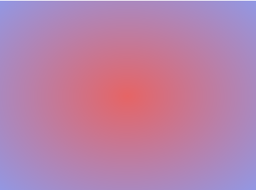
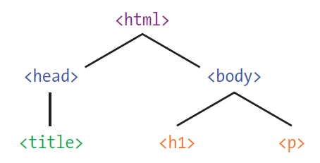

# Введение в JavaScript в вебе

## Градиент

### Линейный градиент

Для того, что бы можно было добавить линейный градиент используется свойство CSS `linear-gradient`.
При этом параметрами задаются начальный и конечные цвета.

Пример:

```css
background: linear-gradient(#e66465, #9198e5);
```

Результат:


Промежуточных цветов может быть несколько, как и направление градиента.

Пример:

```css
background: linear-gradient(to bottom, red, green 50%, #eee 75%, blue 75%, white 100%);
```

Результат:



## Радиальный градиент

Для того, что бы можно было добавить радиальный (по кругу) градиент используется свойство CSS `radial-gradient`.

Пример:

```css
background: radial-gradient(#e66465, #9198e5);
```

Результат:



Также как и для линейного градиента можно задать несколько цветов и положение центра окружности.

Пример:

```css
background: radial-gradient(circle at 100%, #333, #333 50%, #eee 75%, #333 75%);
```

Результат:


## JavaScript

Для того, что бы можно было оживлять наши веб страницы мы добавим `JavaScript`.
Это можно сделать двумя способами.

Первый - в любом месте `html` документа добавить тег &lt;script> внутри которого писать `JavaScript`:

```javaScript
<script>
    alert('Hello JavaScript');
</script>
```

Второй - вынести в отдельный файл, который подключить также через тег &script>:

```JavaScript
<script src='js/script.js'></script>
```

В файле или внутри тега можно писать код на `JavaScript`.

### Поиск элементов DOM

Когда вы открываете `HTML`-документ, браузер преобразовывает его
элементы в древовидную структуру — дерево DOM. На рис. изображено простое дерево DOM — мы уже встречали его в пятой главе, когда говорили об иерархии HTML. Браузер дает `JavaScript`-программистам
возможность доступа к этой древовидной структуре при помощи специальных методов `DOM`:



### Идентификация элементов по id

HTML-элементу можно присвоить уникальное имя, или идентификатор, с помощью атрибута id. Например, у элемента h1 задан атрибут id:

```html
<h1 id="main-heading">Привет, мир!</h1>
```

Задав атрибуту `id` значение (в данном случае "main-heading"), мы
получаем возможность впоследствии найти этот конкретный заголовок
по его id и что-нибудь с ним сделать, не затрагивая остальные элементы,
даже если это другие заголовки уровня h1.

### Поиск элемента с помощью getElementById

Обозначив элемент уникальным `id` (каждый id в документе должен
иметь собственное, отличное от других значение), мы можем воспользоваться DOM-методом `document.getElementById`, чтобы найти элемент "main-heading":

```JavaScript
var headingElement = document.getElementById("main-heading");
```

Вызовом document.getElementById("main-heading") мы даем
браузеру команду отыскать элемент, id которого равен "main-heading".

Когда элемент найден, им можно управлять при помощи JavaScript-кода. Например, через свойство
innerHTML мы можем узнать, что за текст находится внутри элемента, или заменить этот текст:

```JavaScript
console.log(headingElement.innerHTML);
```

Эта команда возвращает содержимое `headingElement —
элемента`, который мы нашли с помощью `getElementById`.
В данном случае содержимое — это текст "Привет, мир!",
находящийся между тегов &lt;h1>.

### Изменение стиля

Для того, что бы задать стиль элемента необходимо обратиться к его свойству `style`.

Например, для того, что бы можно было изменить свойство фона элемента нужно вызвать:

```JavaScript
headingElement.style.background = "red";
```

При этом фон станет красным!

### События клавиатуры

Состояние клавиатуры можно отслеживать в `JavaScript` с помощью событий клавиатуры. Каждый раз, когда пользователь нажимает клавишу,
генерируется событие. Мы будем отслеживать событие `keydown`, которое возникает при
нажатии клавиши, зададим обработчик этого
события. Таким образом, при каждом возникновении события `keydown` наш обработчик сможет определить нажатую клавишу и нужным образом на это отреагировать.

Для добавления глобального обработчика события нужно добавить код:

```JavaScript
window.addEventListener('keydown', function (event) { // когда нажали на кнопку на клавиатуре
        console.log(event.code);

        // здесь будет кода
}
```

Информация о событии передается в функцию через объект `event`. В данном случае мы хотим узнать, какая клавиша была нажата, и эти сведения хранятся в свойстве `code` объекта `event`.
В теле функции мы используем `console.log`, чтобы вывести значение свойства `code`: это строка, соответствующее нажатой клавише. Каждой из клавиш соответствует уникальный числовой код,
например код клавиши «пробел» равен "Space", а код стрелки влево — "ArrowLeft".

Помимо события связанного с нажатием клавиши на клавиатуре есть и другие события, например, загрузки страницы.
Это событие важно отслеживать в особенности если тек &lt;script> расположен внутри тега &lt;head>:

```JavaScript
window.addEventListener('load', function () { // когда документ загружен
    // здесь будет код
}
```

# Ссылки

1. [MDN: линейный градиент](https://developer.mozilla.org/uk/docs/Web/CSS/linear-gradient)
2. [MDN: радиальный градиент](https://developer.mozilla.org/uk/docs/Web/CSS/radial-gradient)
3. [Генератор градиентов](https://cssgradient.io/)
4. [Поиск элементов DOM](https://learn.javascript.ru/searching-elements-dom)
5. [События](https://learn.javascript.ru/introduction-browser-events)
6. [События клавиатуры](https://learn.javascript.ru/keyboard-events)