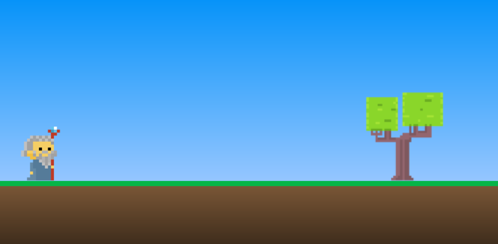
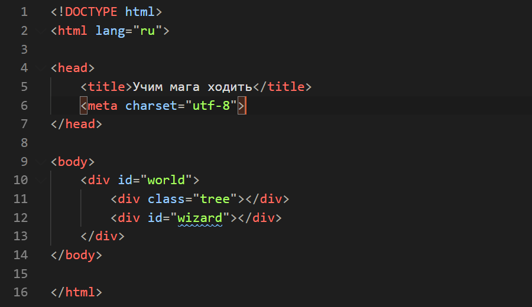
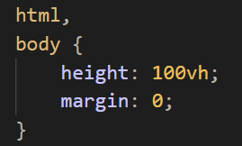
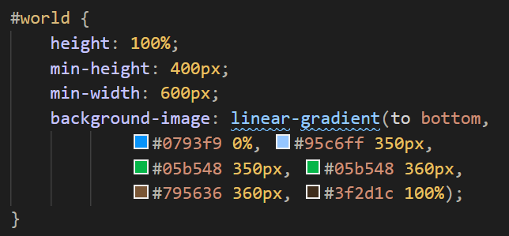
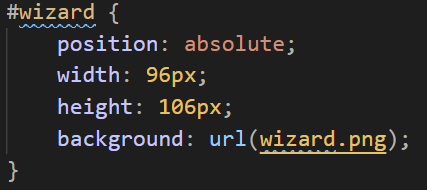
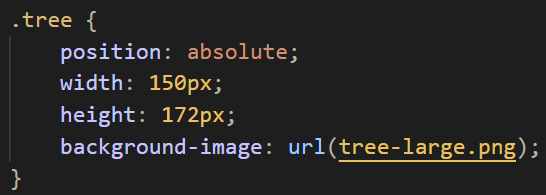

# Практическое задание

Необходимо создать магический мир



Для этого нам необходимо выполнить следующие шаги:

1. Загрузить заготовку проекта по [ссылке](magick-world.zip) и распаковать на рабочий стол.
2. В папке `magick-world` есть пустой файл `index.html`, в который нужно написать следующий код:

    

3. В папку `css` добавить файл `world.css` со следующим содержимым:

    

    

4. Для применения стиля необходимо добавит в тег &lt;head> элемент в файле `index.html`:

    ```html
    <link href="css/world.css" rel="stylesheet" />
    ```

    В результате в браузере должно появиться небо и земля

5. Теперь пора добавить мага. Для этого в стилевой файл `world.css` добавляем следующий стиль для идентификатора `#wizard`:

    

6. Добавим дерево. Для этого в тот же файл добавим стиль для класса `.tree`:

    

Переходим ко [второй части](part2.md) практического занятия на котором мы будим учить ходить мага.