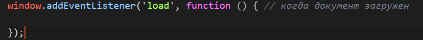
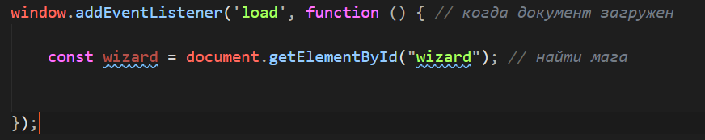
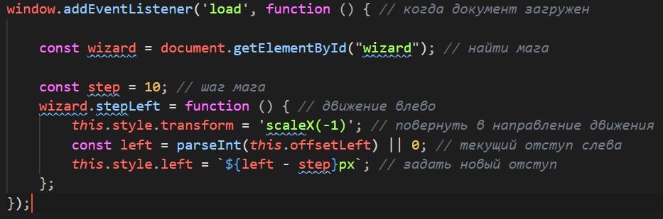
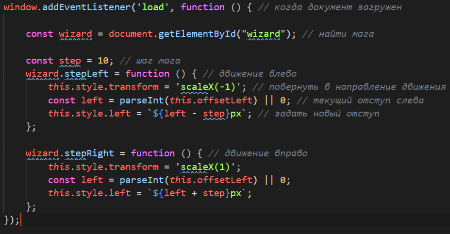
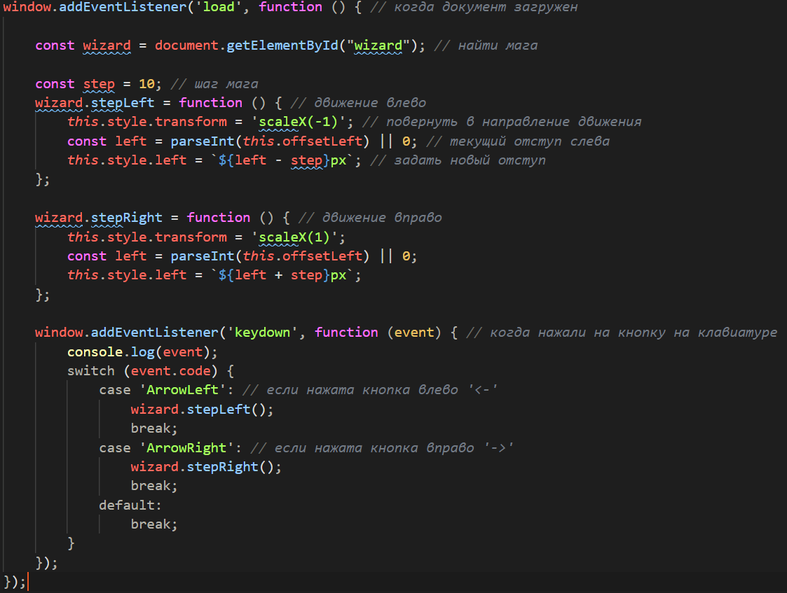

# Практическое задание

Теперь нам необходимо применить `JavaScript` для того, что бы научить мага ходить.

1. В папку с проектом необходимо добавить папку `js`, в котору поместить файл `script.js`
2. Подключить `JavaScript` файл в `html` документе через тег `script` внутри тега &lt;head>:

    ```html
    <script src="js/script.js"></script>
    ```

3. В файл `script.js` необходимо добавить обработчик события загрузки окна `window.addEventListener('load', function(){})`:

    

4. Внутри обработчика события загрузки окна объявить константу `wizard` в которой сохранить объект с идентификатором `#wizard`:

    

5. Дальше необходимо добавить метод `stepLeft()` для перемещения мага влево:

    

6. Аналогично реализовать метод `stepRight()` для перемещения маша вправо:

    

7. Теперь осталось вызвать эти методы когда происходит нажатие кнопок на клавиатуре стрелка влево (`ArrowLeft`) или стрелка вправо (`ArrorRight`):

    