# Домашнее задание

Практика на работу с DOM

Ваша задача - создать галерею изображений как на гифке:


Заготовка домашнего задания находится в архиве [gallery.zip](gallery.zip),
которую необходимо скачать и распаковать на рабочий стол.

Открыть папку `gallery` в Visual Studio Code.

Внимательно изучите файл `index.html` и `style.css` прежде чем выполнять домашнее задание.

Выполнить следующие шаги:

1. В папку `js` добавить файл `script.js`
2. Подключить файл `script.js` в `index.html` **перед закрывающим тегом** &lt;/body>:

    ```html
    <script src='js/script.js'></script>
    ```

    Далее весь код пишем в файле `script.js`.

3. Нам необходимо найти все элементы с классами `slide`, которые в html находятся внутри тега `main`:

    ```html
        <main>
            <figure class="slide">
                <div class="numbertext">1 / 3</div>
                
                <figcaption>Caption Text</figcaption>
            </figure>

            <figure class="slide">
                <div class="numbertext">2 / 3</div>
                
                <figcaption>Caption Two</figcaption>
            </figure>

            <figure class="slide">
                <div class="numbertext">3 / 3</div>
                
                <figcaption>Caption Three</figcaption>
            </figure>

            <a class="prev">❮</a>
            <a class="next">❯</a>
        </main>
    ```

    Для этого в файле `script.js` используя функцию `querySelectorAll()` находим все элементы у которых задан класс `slide`:

    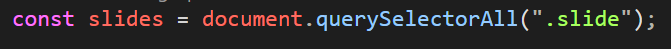

    Для того, что бы изображения сменяли друг друга необходимо будет все изображения скрыть и отобразить только одно.

4. Для управления галереей в `html` есть кнопка влево (элемент с классом `prev`) и кнопка вправо (элемент с классом `next`). Находим эти элементы при помощи функции `querySelector()` (почему не `querySelectorAll`?):

    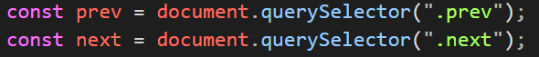

5. Для перехода между изображениями также могут быть использованы точки (элементы с классом `dot`):

    ```html

        <div class="indicators">
            <span class="dot"></span>
            <span class="dot"></span>
            <span class="dot"></span>
        </div>
    ```

    Находим и эти элементы через функцию `querySelectorAll()`:

    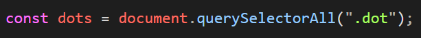

6. Далее нам необходимо написать основную функцию `showSlides()`, которая будет использована для скрытия/отображения нужного изображения:

    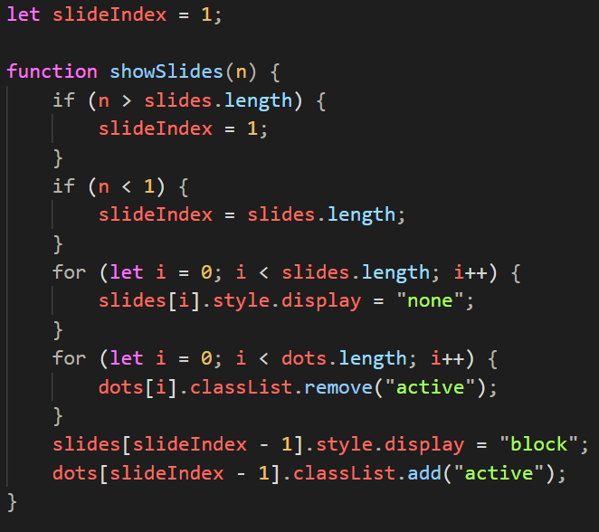

    **Пояснения**: перед функцией мы видим объявление переменной `slideIndex`, которая предназначена для хранения индекса текущего изображения.

    Функция `showSlides` принимает в качестве параметра `n` - индекс слайда (изображения), который нужно отобразить.

    При этом есть вероятность, что `n` будет больше фактического количества слайдов (можно узнать по размеру массива `slides`) или будет меньше единицы.

    Что бы этого избежать в начале функции `showSlides` есть две проверки:

    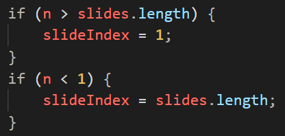

    Дальше идет цикл, в котором для каждого слайда задается стиль `display: none`, что означает скрытие абсолютно всех слайдов:

    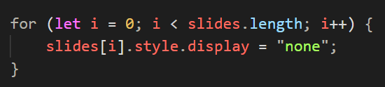

    Дальше видим цикл, в котором для каждой точки управления (класс `dot`) удаляется класс `active` (который устанавливает стиль активного слайда):

    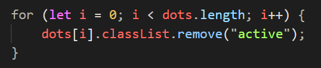

    После этого отображаем активный слайд (задаем `display: block`) и устанавливаем класс `active` для точки управления с индексом `slideIndex - 1`:

    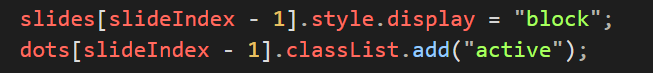

7. Следующий шаг - вызываем объявленный выше метод `showSlides()` передавая в качестве параметра значение `slideIndex`:

    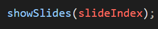

8. Для того, что бы было возможным переключать слайды через стрелки (`.prev` и `.next`), добавляем обработчики события клика по указанным кнопкам:

    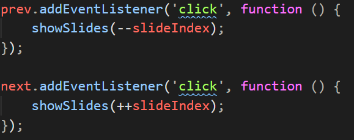

9. Для того, что бы было возможным переключать слайды через управляющие точки, добавляем аналогичный код (в цикле перебираем все точки):

    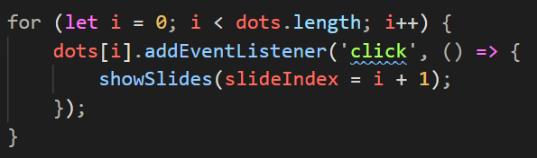

**Дополнительное задание на 12 баллов**: добавить дополнительный картинки в галерею.

После выполнения всех шагов необходимо заархивировать папку gallery и отправить на [mystat](https://mystat.itstep.org/) на проверку.
