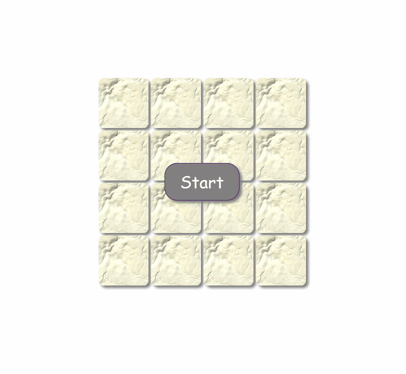

# Домашнее задание

В домашнем задании необходимо реализовать заготовку для игры в пятнашки.

Результат должен выглядеть следующим образом:

При клике по кнопке "Start" кости заполняются числами от 1 до 15 (в случайном порядке),
при этом сама кнопка "пропадает".

Заготовку проекта (html/css) можно загрузить по ссылке [fifteen](fifteen.zip)